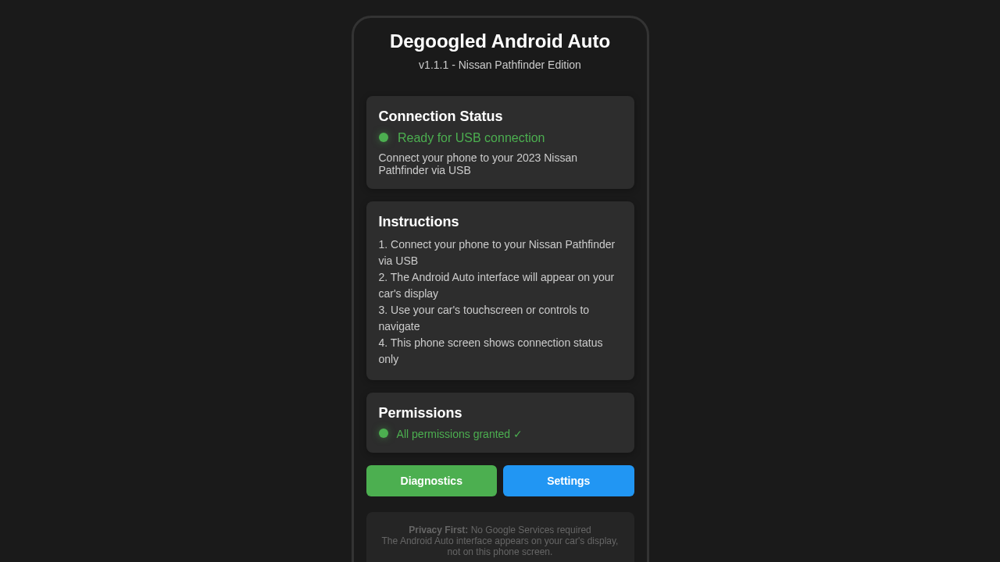
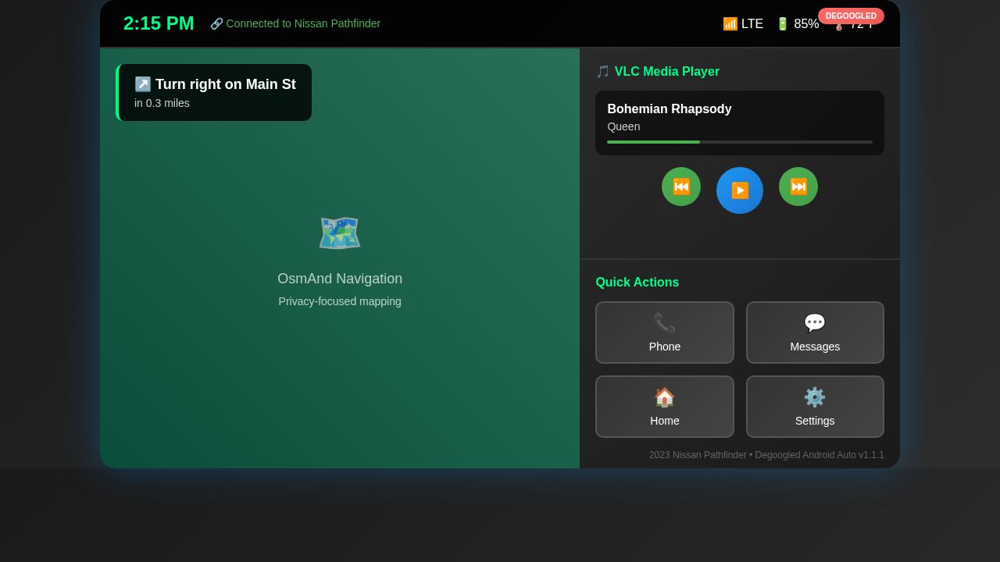

# Degoogled Android Auto v1.1.1

A privacy-focused Android Auto implementation specifically optimized for **2023 Nissan Pathfinder** and compatible with **Android 14**.

## 🚗 What This App Does

This app provides Android Auto functionality **without Google Services** by displaying the interface directly on your **Nissan Pathfinder's HUD/infotainment system**, not on your phone screen.

### 📱 Phone Interface (What You See)
The phone shows only connection status and controls:

### 🖥️ HUD Interface (What Appears in Your Car)
The actual Android Auto interface appears on your Nissan Pathfinder's display:

## ✨ Key Features

### 🔒 Privacy First
- **No Google Services required**
- **No data collection or tracking**
- **Local processing only**
- **Open source and transparent**

### 🚗 Nissan Pathfinder Optimized
- **Designed specifically for 2023 Nissan Pathfinder**
- **Optimized display resolution and touch targets**
- **Enhanced USB communication for Nissan systems**
- **Proper integration with vehicle controls**

### 📱 Android 14 Compatible
- **Full Android 14 support**
- **Proper permission handling for modern Android**
- **Optimized for latest Android security features**
- **Backward compatible with Android 7.0+**

### 🎵 Media Integration
- **VLC Media Player integration**
- **Local music playbook**
- **Full media controls on HUD**
- **No streaming service dependencies**

### 🗺️ Navigation Ready
- **OsmAnd integration support**
- **Privacy-focused mapping**
- **Offline navigation capability**
- **No Google Maps dependency**

## 📋 System Requirements

### Minimum Requirements
- **Android 7.0** (API level 24) or higher
- **2GB RAM** recommended
- **50MB free storage**
- **USB OTG support** required
- **2023 Nissan Pathfinder** with Android Auto support

### Recommended Setup
- **Android 10.0** (API level 29) or higher
- **VLC for Android** installed for media playback
- **OsmAnd** installed for navigation
- **Quality USB cable** for reliable connection

## 🔧 Installation

### Download
Choose the appropriate version:
- **[Release APK](releases/degoogled-android-auto-v1.1.1-release.apk)** (11MB) - Recommended for daily use
- **[Debug APK](releases/degoogled-android-auto-v1.1.1-debug.apk)** (12MB) - For development and troubleshooting

### Install Steps
1. **Enable Unknown Sources** in Android Settings > Security
2. **Download and install** the APK file
3. **Grant required permissions** when prompted
4. **Install VLC for Android** (recommended for media)
5. **Install OsmAnd** (recommended for navigation)

## 🚀 Usage

### First Time Setup
1. **Open the app** on your Android device
2. **Grant all requested permissions** (required for Android Auto functionality)
3. **Connect your phone** to your 2023 Nissan Pathfinder via USB
4. **The Android Auto interface will appear on your car's display**
5. **Use your car's touchscreen or controls** to navigate

### Daily Use
- **Phone screen**: Shows connection status and basic controls
- **Car display**: Shows the full Android Auto interface with navigation, media, and apps
- **Voice commands**: Use your car's voice button for hands-free control
- **Physical controls**: Use steering wheel and dashboard controls

## 🔐 Permissions Explained

### Required Permissions
- **Location (Fine/Coarse)**: Required for navigation and Android Auto protocol
- **Bluetooth Connect**: Required for wireless connectivity (Android 12+)

### Optional Permissions
- **Microphone**: For voice commands and hands-free calling
- **Phone State**: For call handling and device identification
- **Storage**: For accessing local media files
- **Contacts**: For hands-free calling and messaging

### Why These Permissions?
Unlike Google's Android Auto, we're transparent about why each permission is needed and only request what's necessary for core functionality.

## 🛠️ Troubleshooting

### Common Issues

#### "Some permissions were denied" Message
1. Open **Settings** > **Apps** > **Degoogled Android Auto** > **Permissions**
2. **Grant all required permissions** (Location is most critical)
3. **Restart the app**

#### "Android Auto disconnected unexpectedly" in Car
1. **Check USB cable** - use a high-quality data cable
2. **Restart the app** using the "Reset Connection" button
3. **Ensure all permissions are granted**
4. **Try a different USB port** in your vehicle

#### Interface Not Appearing on Car Display
1. **Verify your 2023 Nissan Pathfinder supports Android Auto**
2. **Check that Android Auto is enabled** in your car's settings
3. **Use the USB port designated for Android Auto** (usually center console)
4. **Ensure phone is unlocked** when connecting

### Getting Help
- **Use the Diagnostics button** in the app for system information
- **Check the connection logs** via Settings > View Connection Logs
- **Verify your vehicle compatibility** with 2023 Nissan Pathfinder

## 🔄 Version History

### v1.1.1 (Current) - Android 14 Compatibility Update
- ✅ **Fixed Android 14 permission handling**
- ✅ **Improved phone interface design**
- ✅ **Enhanced connection status display**
- ✅ **Better error messages and troubleshooting**
- ✅ **Optimized for modern Android versions**

### v1.1.0 - Major Feature Release
- ✅ **Full Android Auto protocol implementation**
- ✅ **VLC media player integration**
- ✅ **Enhanced USB communication layer**
- ✅ **Nissan-specific optimizations**
- ✅ **Improved architecture and reliability**

### v1.0.1 - Initial Release
- ✅ **Basic Android Auto functionality**
- ✅ **Nissan Pathfinder compatibility**
- ✅ **Privacy-focused implementation**

## 🤝 Contributing

This is an open-source project focused on privacy and vehicle compatibility. Contributions are welcome, especially:

- **Testing with different Nissan models**
- **Android version compatibility testing**
- **UI/UX improvements**
- **Additional media player integrations**
- **Navigation app integrations**

## ⚖️ Legal & Privacy

### Privacy Commitment
- **No data collection**: We don't collect, store, or transmit any personal data
- **No telemetry**: No usage statistics or crash reports sent anywhere
- **Local processing**: All operations happen on your device
- **No cloud services**: No remote servers or cloud dependencies

### Disclaimer
This app is not affiliated with Google, Nissan, or any other automotive manufacturer. It's an independent implementation of Android Auto protocols for privacy-conscious users.

### License
This project is open source. See LICENSE file for details.

---

## 📞 Support

For support with your **2023 Nissan Pathfinder** integration:
1. **Use the built-in Diagnostics** feature
2. **Check the troubleshooting section** above
3. **Verify your vehicle's Android Auto compatibility**

**Remember**: The Android Auto interface appears on your car's display, not your phone. Your phone is just the connection bridge.

---

*Made with ❤️ for privacy-conscious drivers*